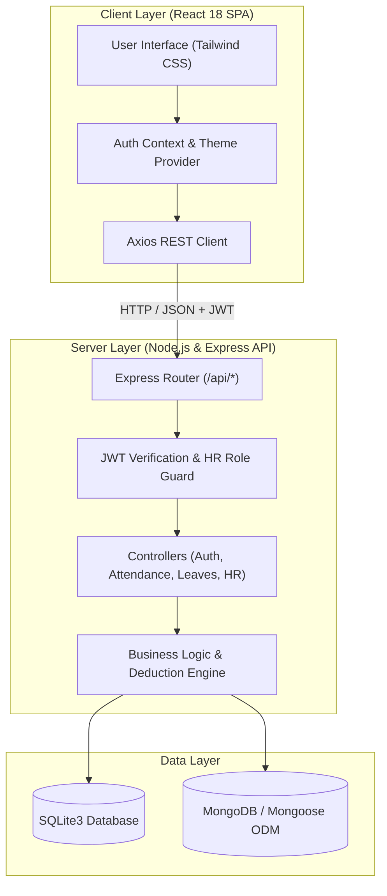

# Employee Attendance Management System

**Tech Stack:** MERN (MongoDB, Express.js, React 18, Node.js) | **Styling:** Tailwind CSS

An enterprise-grade, production-ready **Employee Attendance Management System** developed using the MERN stack. Designed with modular architecture, strict role-based access control, real-time UTC timestamping, working hours and overtime calculation engines, an automated leave deduction rules engine, bulk Excel data import capabilities, and interactive HR analytics dashboards.

---

## Technical Features & Requirements Checklist

| Requirement | Implementation Status | Technical Details |
| :--- | :--- | :--- |
| **Role-Based Authentication** | Completed | JWT stateless authentication, bcrypt password hashing, role guard middlewares (`EMPLOYEE` vs `HR_ADMIN`). |
| **Attendance Check-In / Check-Out** | Completed | ISO 8601 UTC timestamp storage with browser local rendering, same-day duplicate check-in guard rails, active shift timer. |
| **Working Hours Calculation** | Completed | Computes net duration (`checkOut - checkIn`) in exact decimal hours and overtime beyond standard 8-hour shift. |
| **Automated Leave Deduction Engine** | Completed | Policy status assignment ($\ge 8\text{h} \to \text{PRESENT}$, $4\text{ to } <8\text{h} \to \text{HALF\_DAY}$, $<4\text{h} \to \text{ABSENT}$). Auto debit sequence: `Casual Leave` $\to$ `Sick Leave` $\to$ `Unpaid Leave`. |
| **Bulk Excel / CSV Import** | Completed | Multi-format upload (`.xlsx`, `.xls`, `.csv`) via `multer` and `xlsx` parser, template downloader, duplicate check, auto quota initialization. |
| **HR Administration Dashboard** | Completed | Real-time workforce metrics, Recharts trend charts, master attendance log search & filters, manual override modal, CSV report exporter. |
| **Employee Self-Service Portal** | Completed | One-click clock terminal, monthly attendance history timeline, leave quota counters, leave request modal. |

---

## Technology Stack Architecture

### System Architecture Diagram

```
+-----------------------------------------------------------------------------------+
|                                 CLIENT LAYER                                      |
|  +-----------------------------------------------------------------------------+  |
|  |                  React 18 SPA (Vite + Tailwind CSS)                         |  |
|  |   [Employee Dashboard]   [HR Admin Suite]   [Theme Provider]   [Axios API]  |  |
|  +---------------------------------------+-------------------------------------+  |
+------------------------------------------|----------------------------------------+
                                           | HTTP / REST (JWT Bearer Token)
                                           v
+-----------------------------------------------------------------------------------+
|                                 SERVER LAYER                                      |
|  +-----------------------------------------------------------------------------+  |
|  |                             Express.js REST API                             |  |
|  |  [CORS / JSON Parser] -> [JWT Auth Middleware] -> [Role Guard (isHRAdmin)]  |  |
|  +---------------------------------------+-------------------------------------+  |
|                                          |                                        |
|  +---------------------------------------v-------------------------------------+  |
|  |                             CONTROLLER LAYER                                |  |
|  |   [authController]   [attendanceController]   [leaveController]  [hrController]|  |
|  +---------------------------------------+-------------------------------------+  |
|                                          |                                        |
|  +---------------------------------------v-------------------------------------+  |
|  |                          BUSINESS LOGIC SERVICES                            |  |
|  |  * Working Hours Engine (checkOut - checkIn)                                    |  |
|  |  * Leave Deduction Hierarchy (Casual -> Sick -> Unpaid)                       |  |
|  |  * Status Classification (PRESENT / LATE / HALF_DAY / ABSENT)                |  |
|  |  * Bulk Excel Parser (Multer + SheetJS XLSX)                                  |  |
|  +---------------------------------------+-------------------------------------+  |
+------------------------------------------|----------------------------------------+
                                           | Data Access Layer
                                           v
+-----------------------------------------------------------------------------------+
|                                DATABASE LAYER                                     |
|  +---------------------------------------+-------------------------------------+  |
|  |     SQLite3 Relational DB Engine      |     MongoDB Mongoose ODM Schemas    |  |
|  |  (users, attendance, leave_balances,  | (User.js, Attendance.js,             |  |
|  |   leave_requests, company_settings)   |  LeaveBalance.js, LeaveRequest.js)  |  |
|  +---------------------------------------+-------------------------------------+  |
+-----------------------------------------------------------------------------------+
```

### Component Flow (Mermaid Architecture)



### Technology Breakdown

- **Frontend**: React 18 (Vite build tool), Tailwind CSS, Recharts (14-day attendance trend & department share charts), Lucide Icons, Axios.
- **Backend**: Node.js, Express.js REST API, JSON Web Tokens (`jsonwebtoken`), `bcryptjs`, `multer`, `xlsx` (SheetJS).
- **Database**: SQLite3 (`sqlite3`) and MongoDB (`mongoose`) ODM.

---

## Database Architecture & Schemas

The system supports both Relational SQL (SQLite3 DDL) and Document Object (MongoDB Mongoose) database models.

### Relational Database Schema (SQL DDL)

```sql
-- 1. Users Table
CREATE TABLE users (
  id INTEGER PRIMARY KEY AUTOINCREMENT,
  name TEXT NOT NULL,
  email TEXT UNIQUE NOT NULL,
  password_hash TEXT NOT NULL,
  role TEXT NOT NULL DEFAULT 'EMPLOYEE', -- 'HR_ADMIN' or 'EMPLOYEE'
  department TEXT DEFAULT 'Engineering',
  position TEXT DEFAULT 'Software Engineer',
  employee_code TEXT UNIQUE,
  join_date TEXT,
  created_at DATETIME DEFAULT CURRENT_TIMESTAMP
);

-- 2. Shifts Table
CREATE TABLE shifts (
  id INTEGER PRIMARY KEY AUTOINCREMENT,
  name TEXT NOT NULL,
  start_time TEXT NOT NULL DEFAULT '09:00',
  end_time TEXT NOT NULL DEFAULT '17:00',
  grace_period_mins INTEGER DEFAULT 15,
  half_day_hours REAL DEFAULT 4.0,
  full_day_hours REAL DEFAULT 8.0
);

-- 3. Attendance Records Table
CREATE TABLE attendance (
  id INTEGER PRIMARY KEY AUTOINCREMENT,
  user_id INTEGER NOT NULL,
  date TEXT NOT NULL, -- Format: YYYY-MM-DD
  check_in TEXT,      -- ISO 8601 UTC String
  check_out TEXT,     -- ISO 8601 UTC String
  working_hours REAL DEFAULT 0.0,
  overtime_hours REAL DEFAULT 0.0,
  status TEXT NOT NULL DEFAULT 'PRESENT', -- 'PRESENT', 'LATE', 'HALF_DAY', 'ABSENT', 'ON_LEAVE'
  notes TEXT,
  created_at DATETIME DEFAULT CURRENT_TIMESTAMP,
  FOREIGN KEY (user_id) REFERENCES users(id) ON DELETE CASCADE,
  UNIQUE(user_id, date)
);

-- 4. Leave Balances Table
CREATE TABLE leave_balances (
  id INTEGER PRIMARY KEY AUTOINCREMENT,
  user_id INTEGER UNIQUE NOT NULL,
  casual_leave REAL DEFAULT 10.0,
  sick_leave REAL DEFAULT 12.0,
  earned_leave REAL DEFAULT 15.0,
  unpaid_leave REAL DEFAULT 0.0,
  deducted_leave REAL DEFAULT 0.0,
  updated_at DATETIME DEFAULT CURRENT_TIMESTAMP,
  FOREIGN KEY (user_id) REFERENCES users(id) ON DELETE CASCADE
);

-- 5. Leave Requests Table
CREATE TABLE leave_requests (
  id INTEGER PRIMARY KEY AUTOINCREMENT,
  user_id INTEGER NOT NULL,
  leave_type TEXT NOT NULL, -- 'CASUAL', 'SICK', 'EARNED', 'UNPAID'
  start_date TEXT NOT NULL,
  end_date TEXT NOT NULL,
  total_days REAL NOT NULL,
  reason TEXT,
  status TEXT NOT NULL DEFAULT 'PENDING', -- 'PENDING', 'APPROVED', 'REJECTED'
  hr_comments TEXT,
  created_at DATETIME DEFAULT CURRENT_TIMESTAMP,
  FOREIGN KEY (user_id) REFERENCES users(id) ON DELETE CASCADE
);

-- 6. Company Settings Table
CREATE TABLE company_settings (
  key TEXT PRIMARY KEY,
  value TEXT NOT NULL,
  description TEXT
);
```

### Document ODM Models (MongoDB / Mongoose)

- **User Model (`backend/src/models/User.js`)**:
  ```javascript
  {
    name: { type: String, required: true },
    email: { type: String, required: true, unique: true, lowercase: true },
    password_hash: { type: String, required: true },
    role: { type: String, enum: ['EMPLOYEE', 'HR_ADMIN'], default: 'EMPLOYEE' },
    department: { type: String, default: 'General' },
    position: { type: String, default: 'Staff Member' },
    employee_code: { type: String, required: true, unique: true },
    join_date: { type: String, default: () => new Date().toISOString().split('T')[0] }
  }
  ```

- **Attendance Model (`backend/src/models/Attendance.js`)**:
  ```javascript
  {
    user_id: { type: Schema.Types.ObjectId, ref: 'User', required: true },
    date: { type: String, required: true },
    check_in: { type: String },
    check_out: { type: String },
    working_hours: { type: Number, default: 0.0 },
    overtime_hours: { type: Number, default: 0.0 },
    status: { type: String, enum: ['PRESENT', 'LATE', 'HALF_DAY', 'ABSENT', 'ON_LEAVE'], default: 'PRESENT' },
    notes: { type: String }
  }
  ```

- **Leave Balance Model (`backend/src/models/LeaveBalance.js`)**:
  ```javascript
  {
    user_id: { type: Schema.Types.ObjectId, ref: 'User', required: true, unique: true },
    casual_leave: { type: Number, default: 10.0 },
    sick_leave: { type: Number, default: 12.0 },
    earned_leave: { type: Number, default: 15.0 },
    unpaid_leave: { type: Number, default: 0.0 },
    deducted_leave: { type: Number, default: 0.0 }
  }
  ```

- **Leave Request Model (`backend/src/models/LeaveRequest.js`)**:
  ```javascript
  {
    user_id: { type: Schema.Types.ObjectId, ref: 'User', required: true },
    leave_type: { type: String, enum: ['CASUAL', 'SICK', 'EARNED', 'UNPAID'], required: true },
    start_date: { type: String, required: true },
    end_date: { type: String, required: true },
    total_days: { type: Number, required: true },
    reason: { type: String },
    status: { type: String, enum: ['PENDING', 'APPROVED', 'REJECTED'], default: 'PENDING' },
    hr_comments: { type: String }
  }
  ```

---

## Business Logic & Policy Guard Rails

1. **Shift Schedule & Grace Period**:
   - Default Shift: `09:00 AM` to `05:00 PM` (8 Hours target).
   - Grace Period: `15 minutes` (Check-ins up to `09:15 AM` are marked `PRESENT`). Check-ins after `09:15 AM` are classified as `LATE`.
   - Late Penalty Rule: Every 3 late check-ins trigger an automated `0.5-day` leave balance deduction.

2. **Working Duration & Penalty Hierarchy**:
   - $\ge 8.0\text{ hours} \implies \text{PRESENT}$ (0 leave deduction).
   - $4.0 \text{ to } <8.0\text{ hours} \implies \text{HALF\_DAY}$ (Auto-deducts **0.5 days**).
   - $<4.0\text{ hours} / \text{No punch} \implies \text{ABSENT}$ (Auto-deducts **1.0 day**).
   - Deduction Hierarchy Sequence: `Casual Leave` $\to$ `Sick Leave` $\to$ `Unpaid Leave (Loss of Pay)`.

3. **Same-Day Duplicate Punch Protection**:
   - Database level `UNIQUE(user_id, date)` constraint combined with API validation prevents multiple active check-ins on the same calendar date.

---

## API Endpoint Specification

### Authentication Routes
- `POST /api/auth/login` - Authenticate user and issue JWT bearer token.
- `POST /api/auth/register` - Create a new user profile.
- `GET /api/auth/me` - Fetch authenticated user profile and leave balances (Requires JWT).

### Attendance Operations
- `POST /api/attendance/check-in` - Record check-in ISO UTC timestamp (Requires JWT).
- `POST /api/attendance/check-out` - Record check-out timestamp and compute worked hours (Requires JWT).
- `GET /api/attendance/today` - Fetch today's shift status and check-in details (Requires JWT).
- `GET /api/attendance/my-history` - Retrieve personal monthly attendance log and deduction summary (Requires JWT).

### Leave Operations
- `POST /api/leaves/apply` - Submit a new leave application (Requires JWT).
- `GET /api/leaves/my-leaves` - Retrieve personal leave requests and balance quotas (Requires JWT).

### HR Administration (Requires JWT + `HR_ADMIN` Role)
- `GET /api/hr/stats` - Fetch executive workforce metrics.
- `GET /api/hr/analytics` - Retrieve 14-day attendance trends and department headcount charts.
- `GET /api/hr/employees` - List all employee profiles, positions, and leave quotas.
- `POST /api/hr/upload-employees` - Upload `.xlsx`, `.xls`, or `.csv` file for bulk employee provisioning.
- `GET /api/hr/sample-excel` - Download formatted sample Excel import spreadsheet template.
- `GET /api/hr/attendance` - Query master attendance log with date, status, and search filters.
- `POST /api/hr/attendance/manual` - Perform HR manual attendance entry override.
- `GET /api/hr/leaves` - View pending and historical employee leave requests.
- `PATCH /api/hr/leaves/:id/respond` - Approve or reject leave application with HR comments.
- `GET /api/hr/settings` - Retrieve company shift policy settings.
- `POST /api/hr/settings` - Update shift hours and grace period parameters.
- `GET /api/hr/export-csv` - Export master attendance report as downloadable CSV.

---

## Pre-Configured Turnkey Demo Accounts

| Role | Name | Position | Email | Password | Access Level |
| :--- | :--- | :--- | :--- | :--- | :--- |
| **HR Director** | **Himanshi Kalra** | Executive HR Director | `admin@company.com` | `password123` | Full HR Admin Panel, Shift Config, Bulk Excel Import, CSV Export |
| **Employee** | **Sakshi Kumari** | Senior Cloud Architect | `john@company.com` | `password123` | Check-in/out Terminal, Personal Logs, Apply Leave |
| **Employee** | **Ishita Mukherjee** | Lead UX Architect | `emily@company.com` | `password123` | Check-in/out Terminal, Personal Logs, Apply Leave |
| **Employee** | **Anurag Kumar** | Senior Systems Engineer | `anurag@company.com` | `password123` | Check-in/out Terminal, Personal Logs, Apply Leave |
| **Employee** | **Swakshi Singh** | Full Stack Engineer | `swakshi@company.com` | `password123` | Check-in/out Terminal, Personal Logs, Apply Leave |
| **Employee** | **Subham Nayek** | QA Automation Lead | `subham@company.com` | `password123` | Check-in/out Terminal, Personal Logs, Apply Leave |

---

## Local Setup & Execution Guide

### Prerequisites
- Node.js (v18.0 or higher)
- npm (v9.0 or higher)

### 1. Backend API Server Setup
```bash
cd backend
npm install
npm run seed      # Initializes DB schema & seeds turnkey Indian employee accounts
npm start         # Runs Express API server on http://localhost:5000
```

### 2. Frontend React Portal Setup
Open a second terminal window:
```bash
cd frontend
npm install
npm run dev       # Runs React Vite server on http://localhost:5173
```

Navigate to **`http://localhost:5173`** in your browser.
